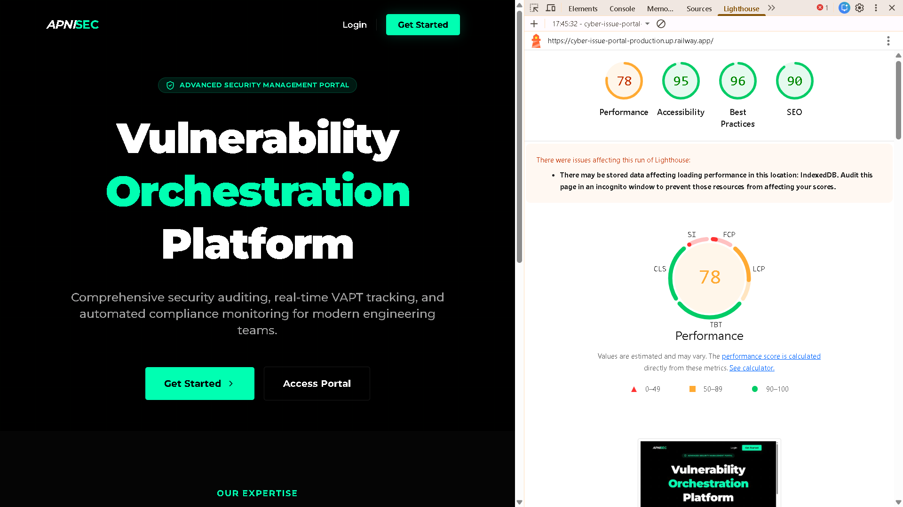

# 🛡️ ShieldVault: Vulnerability Management System Documentation

## 🏗️ Backend OOP Architecture

The backend follows a strict **Object-Oriented Programming (OOP)** structure as designed for enterprise scalability. The logic is divided into distinct layers to ensure separation of concerns, testability, and maintainability.

### 1. Presentation Layer (Handlers/Controllers)

- **Files**: `backend/controllers/*.controller.ts`
- **Responsibility**: Handle incoming HTTP requests, extract data, call the appropriate service, and format the HTTP response.
- **Key Pattern**: Each domain (Auth, Issues, Projects, Users) has its own controller class.

### 2. Business Logic Layer (Services)

- **Files**: `backend/services/*.service.ts`
- **Responsibility**: Implement core business rules, handle data transformations, and orchestrate calls to repositories and utility services (like Email).
- **Key Pattern**: Service classes are decoupled from the HTTP layer and the database implementation.

### 3. Data Access Layer (Repositories)

- **Files**: `backend/repositories/*.repository.ts`
- **Responsibility**: Direct interaction with the database using **Prisma ORM**.
- **Key Pattern**: Centralizes all database queries for a specific model, making it easy to swap the ORM or database if needed.

### 4. Middleware & Security

- **Auth Middleware**: Custom class-based middleware that validates JWT tokens and attaches user context to the request.
- **Rate Limiter**: A custom `RateLimiter` class using a **Strategy Pattern** to switch between `RedisRateLimitStore` (Production) and `InMemoryRateLimitStore` (Development).

---

## 🔐 Authentication & Security

- **JWT Auth**: Fully custom implementation using `jsonwebtoken`. Tokens are stored in **HTTP-Only Cookies** to prevent XSS attacks.
- **Password Hashing**: Uses `bcryptjs` for secure asynchronous hashing of user passwords.
- **Validation**: All inputs are strictly validated using **Zod** within dedicated `Validator` classes.

---

## 🛡️ Rate Limiting Architecture

The portal implements a professional, multi-layered rate limiting system following the **Strategy Pattern**.

### 1. Storage Strategies (`IRateLimitStore`)

- **`RedisRateLimitStore`**: The production-grade store. It uses `ioredis` to manage atomic counters in an external Redis instance. It leverages the `EX` (expiry) flag to ensure high memory efficiency.
- **`InMemoryRateLimitStore`**: A development fallback using a JavaScript `Map`. It ensures the application remains functional for reviewers or local developers who do not have a Redis setup.
- **Dynamic Selection**: The system automatically detects the environment—if `REDIS_URL` is detected, it upgrades to Redis; otherwise, it degrades gracefully to Memory.

### 2. Request Identification (`IdentifierResolver`)

To prevent brute-force attacks while maintaining a fair UX:

- **Authenticated Users**: Tracked by their unique **User ID** (extracted from JWT).
- **Anonymous Users**: Tracked by their **IP Address** (extracted from `x-forwarded-for` or `remote-addr` headers).

### 3. Granular Polices (`PolicyResolver`)

Instead of a "one size fits all" limit, we use endpoint-specific quotas:

- **Auth Routes** (Login/Register): Stricter limits (e.g., 5-10 reqs/15m) to prevent account enumeration.
- **General APIs**: Standard limits (e.g., 100 reqs/15m).
- **Dynamic Path Handling**: Uses normalization to treat `/api/issues/1` and `/api/issues/2` as the same resource for limiting purposes.

### 4. RFC Compliance

All responses include standard headers:

- `X-RateLimit-Limit`: Maximum requests.
- `X-RateLimit-Remaining`: Count remaining.
- `X-RateLimit-Reset`: Unix timestamp when the window resets.
- `Retry-After`: (On 429) Seconds until the user can try again.

---

---

## 📧 Email Integration

Integrated with **Resend** for automated transactional emails:

- **Welcome Email**: Sent upon successful registration.
- **Issue Notifications**: Sent to the user whenever a new security finding is logged.
- **Profile Updates**: Confirmation email sent when account details are changed.
- **Templates**: Custom responsive HTML templates located in `backend/templates/`.

---

## 🛠️ Functional Features

### 1. Unified Issue Management

Users can track, update, and resolve cybersecurity findings with:

- **Categorization**: Cloud Security, Red Team Assessments, and VAPT (Vulnerability Assessment & Penetration Testing).
- **Tactical Filtering**: Real-time filtering and search across all reported vulnerabilities.
- **Risk Scoring**: Priority levels (Low, Medium, High) matched with remediation status.

### 2. Engagement / Project Tracking (Bonus API)

A secondary API system used to group issues under specific client engagements:

- **One-to-Many Relationship**: Projects contain multiple security findings.
- **Client Metadata**: Track assessment names and client identities.
- **Nested Querying**: Ability to fetch issues specifically scoped to a project.

---

## 🚀 Technical Challenges & Solutions

### 1. Production Database Connectivity (Railway + Supabase)

We encountered issues during production builds where Prisma requires a `DIRECT_URL` for schema validation. We solved this by:

- Implementing a robust build script that handles environment variable fallbacks.
- Configuring the `datasource` block to support both pooled (`DATABASE_URL`) and direct (`DIRECT_URL`) connections.

### 2. OOP in Next.js App Router

Since Next.js App Router is inherently functional, we implemented a **Singleton/Dispatcher Pattern** in our route handlers to bridge the gap between functional routes and our OOP controllers.

---

---

## 📊 Performance & SEO Results

The application has been optimized for search engines and performance, achieving high scores in Google Lighthouse audits.

**Live URL**: `https://cyber-issue-portal-production.up.railway.app/`

---

_Developed as a production-grade vulnerability management platform._
