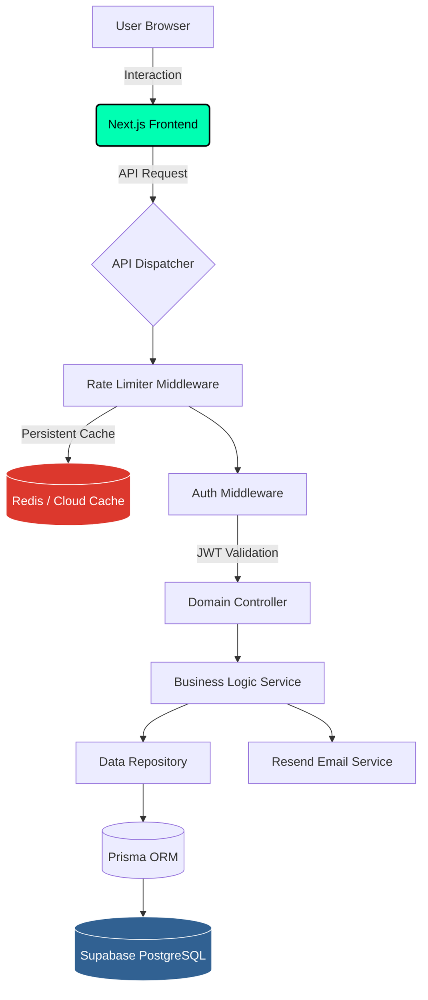
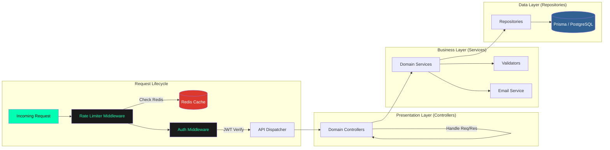

# 🛡️ ShieldVault: Vulnerability Management System

[](https://nextjs.org/)
[](https://www.typescriptlang.org/)
[](https://tailwindcss.com/)
[](https://www.prisma.io/)
[](https://www.postgresql.org/)
[](https://redis.io/)
[](https://supabase.com/)

**ShieldVault** is a premium, high-security vulnerability management portal designed for cybersecurity professionals. It provides a sleek, "hacker-themed" interface to track security findings, manage technical assessments, and maintain a robust audit trail for digital infrastructures.

### 🌐 Live Deployment: [https://cyber-issue-portal.vercel.app/](https://cyber-issue-portal.vercel.app/)

---

## 📊 SEO & Performance

We achieved a **90+ SEO Score** and high performance metrics across both mobile and desktop.


---

## 🏗️ System Architecture & Workflow

### 🔄 Project Execution Flow

The following diagram illustrates how a request moves through the system, from the user's browser to the persistent data layers.



### 🧩 Backend OOP Architecture

The backend is built using a strict **Object-Oriented Programming (OOP)** approach, ensuring separation of concerns and scalability through a layered architecture.



---

## 🚀 Key Features

- **🔐 Enterprise Authentication**: Secure login/registration with JWT stored in HTTP-only cookies and bcrypt password hashing.
- **🛡️ Multi-Level Rate Limiting**: Intelligent API throttling using Redis to prevent brute-force attacks and resource exhaustion.
- **📁 Engagement Management**: Group vulnerability findings under specific projects/clients for better organization.
- **📊 Tactical Dashboard**: Real-time overview of security risks with filtering by vector (Cloud, Red Team, VAPT).
- **📧 Automated Notifications**: Instant email alerts via Resend when new critical findings are logged.
- **✨ Premium UI/UX**: Dark-mode primary design with glassmorphism, micro-animations, and custom-engineered components.

---

## 🛠️ Technology Stack

| Component        | Technology                           |
| :--------------- | :----------------------------------- |
| **Framework**    | Next.js 15 (App Router)              |
| **Language**     | TypeScript (Strict Mode)             |
| **Database**     | PostgreSQL via Supabase              |
| **ORM**          | Prisma                               |
| **Styling**      | Tailwind CSS + Vanilla CSS Variables |
| **Auth**         | JWT (jsonwebtoken) + bcryptjs        |
| **Icons**        | Lucide React                         |
| **Email**        | Resend API                           |
| **Rate Limiter** | Redis (ioredis) / In-Memory Fallback |

---

## ⚙️ Quick Start

1. **Clone & Install**:

   ```bash
   git clone https://github.com/rohanparmar160705/cyber-issue-portal
   cd cyber-issue-portal
   npm install
   ```

2. **Environment Setup**:
   Create a `.env` file based on `.env.example`:

   ```env
   DATABASE_URL="your-supabase-url"
   DIRECT_URL="your-supabase-direct-url"
   JWT_SECRET="your-secret"
   RESEND_API_KEY="your-key"
   REDIS_URL="your-redis-url"
   NEXT_PUBLIC_APP_URL="http://localhost:3000"
   ```

3. **Database Sync**:

   ```bash
   npx prisma generate
   npx prisma db push
   ```

4. **Launch Application**:
   ```bash
   npm run build
   npm run dev
   ```

---

## 📞 Security & Contact

This project follows strictly secure coding practices. For any security inquiries or vulnerability reports regarding the portal itself, please contact the lead developer.

---

_Created with ❤️ by the Rohan Parmar._
